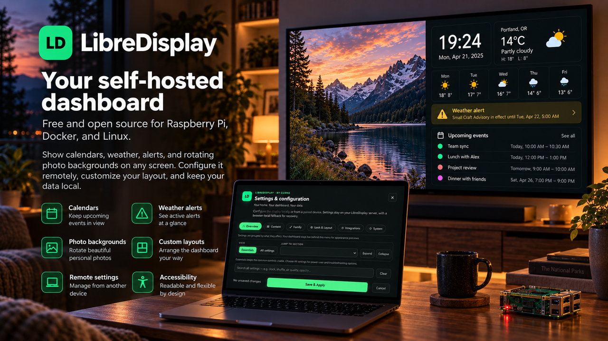

# LibreDisplay

**Your home. Your dashboard. Your data.**  
A free, open-source home dashboard for Raspberry Pi, Docker, NAS, mini PCs, and browsers.

LibreDisplay brings calendars, weather, photos, family information, tasks, media, alerts, and custom data together on one clean display.

<p align="center">
  
</p>

## Quick start — Raspberry Pi

Use a current Raspberry Pi OS **with Desktop**.

For a new installation, paste this single command into Terminal:

```bash
bash -c "$(curl -fsSL https://raw.githubusercontent.com/Gubna-Tech/LibreDisplay/v1.10.28/scripts/install-one-line.sh)"
```

The bootstrap downloads the pinned **v1.10.28** release, validates the archive, then hands off to LibreDisplay's normal installer. It refuses to overwrite an existing `~/libredisplay` installation; existing users should update with `libredisplay update` instead.

Reboot when prompted. LibreDisplay will open automatically.

> Raspberry Pi OS Lite is not supported by the native kiosk installer. Use Raspberry Pi OS with Desktop, or run LibreDisplay with Docker.

## First setup

A new installation opens the setup wizard automatically. It walks you through the display name, weather location, calendars, background, appearance, and optional remote management.

You can skip anything you do not need and change it later from **Settings**. To rerun the wizard, open **Settings > Home > Run setup wizard**.

## Using LibreDisplay

Most day-to-day setup happens from **Settings**:

- **Weather** — location, forecast, and alerts
- **Calendars** — ICS/iCalendar feeds and imported `.ics` files
- **Backgrounds** — stock photos, Google Photos, local folders, or NAS folders
- **Family** — household members, chores, points, and rewards
- **Integrations** — connect supported services and custom data sources
- **Personalization** — themes, typography, accessibility, and layout
- **OLED / always-on display care** — optional dimming, quiet-hours scheduling, deep protection, and pixel shifting for static-display wear reduction
- **Layout** — choose a layout or use Arrange to move and resize dashboard blocks

For local photo folders or NAS shares, use the included setup helpers:

```bash
~/libredisplay/scripts/setup-media.sh
```

```bash
~/libredisplay/scripts/setup-nas.sh
```

## Updating LibreDisplay

Native Raspberry Pi installations show available updates in **Settings > System > Software update**.

The command-line updater is also available:

```bash
libredisplay check
```

```bash
libredisplay update
```

Your settings, media, and custom plugins are kept during supported updates.

## Docker

From the extracted LibreDisplay folder:

```bash
chmod +x scripts/docker-setup.sh
```

```bash
./scripts/docker-setup.sh --lan
```

Open the address shown by the script from a device on your home network.

To update an existing Docker installation:

```bash
./scripts/docker-setup.sh update
```

To create a Docker backup:

```bash
./scripts/docker-setup.sh backup
```

## Useful commands

Start LibreDisplay manually on a native Raspberry Pi installation:

```bash
~/libredisplay/scripts/start.sh
```

Check the local server:

```bash
curl http://127.0.0.1:8787/healthz
```

Create a full native backup:

```bash
~/libredisplay/scripts/backup.sh
```

Uninstall LibreDisplay while preserving a copy of local dashboard data:

```bash
~/libredisplay/uninstall.sh
```

## Remote access and privacy

LibreDisplay is intended for a trusted home network or private VPN. Do **not** port-forward LibreDisplay directly to the public Internet.

LibreDisplay does not require a LibreDisplay cloud account and does not send analytics or telemetry to LibreDisplay or third parties. External integrations only contact services you choose to configure.

Each display can have its own read-only Display Link, and local accounts can be limited to specific displays.

## Open source

LibreDisplay is released under the **[MIT License](LICENSE)**.

Copyright (c) 2026 Gubna.
